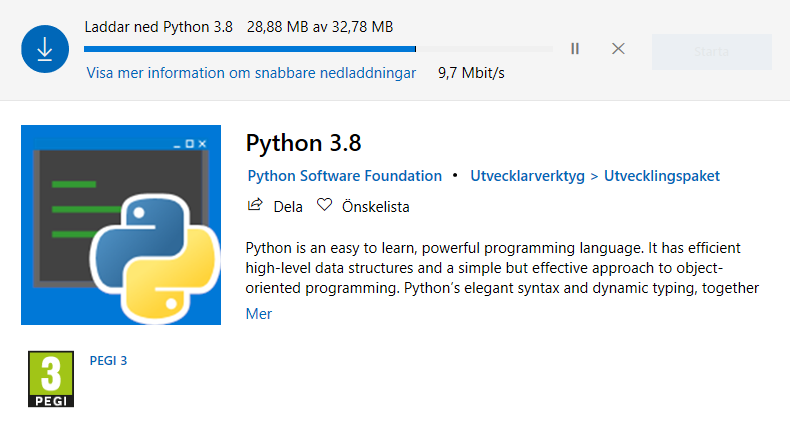
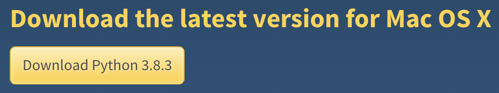

.. _installationer:

Installationer
==============

Här finns instruktioner för hur man installerar **Python** samt den mest populära kod redigeraren, **Visual Studio Code**.
Observera (detta gäller för alla operativsystem) att ifall man har Python färdigt på sin dator men det är en gammal version så
kan man ändå göra allt i Kodanka materialet. Vissa delar i **Fördjupat** och **Projekt** kräver mera funktioner som man kan ladda ned med 
pakethanteraren **pip**. Den kommer färdigt med Python **3.4** och **nyare versioner**. Så har man en äldre version än det 
så kan man helt bra installera en nyare så som instruktionerna visar för att vara på säkra sidan.

Windows
#######

Windows kommer inte med Python färdigt, men man får det lätt från Microsoft Store. Visual Studio Code är också lätt att installera, 
det är trots allt Microsoft som har skapat det.

Python
******

- Öppna **Microsoft Store** genom att söka i nedre balken
- Sök på **Python 3.8** och tryck på **Hämta**

Visual Studio Code
******************

- Gå till https://code.visualstudio.com/download och tryck på ladda ner för Windows
- Kör **.exe** installeraren när det har laddat klart och välj var du vill installera det
- Nu är det bara att starta **Visual Studio Code** när du vill koda

Mac
###

Mac har alltid Python 2 installerat. Det går som sagt bra att lära sig programmera med det, 
men här är instruktioner för hur man installerar en nyare version.

Python
******

- Gå till https://www.python.org/downloads
- Tryck på **Download Python** knappen som laddar ner den senaste Python versionen för Mac OS

- Kör den nerladdade **.pkg** filen och följ dialogen för att installera Python

Visual Studio Code
******************

- Gå till https://code.visualstudio.com/download och tryck på ladda ner för Mac
- Öppna **Visual Studio Code** när det har laddat klart
- Nästa steg är att byta mapp för **Visual Studio Code** 
- Öppna **Finder** > **Downloads**
- Dra **Visual Studio Code** till **Applications** mappen.
- Nu kan man öppna **Visual Studio Code** från **Launch Pad**

Linux
#####

Här finns installations-instruktioner för Debian/Ubuntu. Ifall man har en annan Linux distribution finns det mera information på nätet.
Linux kommer ofta med Python färdigt installerat.

Python
******

- Börja med att öppna terminalen (``Ctrl`` + ``Alt`` + ``T``)
- Kolla om Python redan är installerat genom att i terminalen skriva:

::

  python --version
  python3 --version

- Om ingetdera kommando visar en installerad Python version, eller om den är mindre än 3.4 kan man installera det så här i terminalen:

::

  sudo apt install python3 python3-pip

Visual Studio Code
******************

- Det är lättast att ladda ned som ett Snap paket via terminalen:

::
  
  sudo snap install --classic code

- För mera information eller ifall man har en annan linux distribution: https://code.visualstudio.com/docs/setup/linux

Chromebook
##########

- Vi rekommenderar att koda på nätet med Chromebooks, följ det som står under :ref:`python-online`
- Chrome OS applikationer är i allmänhet på webben så det är lite krångligt att försöka installera något men det ska ändå gå att `göra det via terminalen <https://installpython3.com/chromebook>`_ om man först aktiverar Linux på sin maskin.