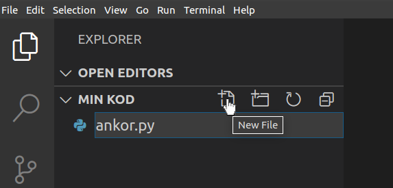

Instruktioner
=============

Materialet är indelat i kapitlen **grunder**, **fördjupat** och **projekt**. 
Det går i naturlig ordning från lättare till mer avancerat, vi börjar med helt grundläggande koncept i första kapitlet som alla program bygger på.
I den fördjupade delen ser vi hur programmering kan användas för att utföra algoritmer (systematiskt lösa problem), göra grafer, bygga artficiell intelligens m.m. 
Till sist har vi projekt delen där vi går igenom lite längre program som visar hur skojiga saker man faktiskt kan göra med kod. 
Det är bara att välja de stycken man tycker att intresserar, men observera att de i början bygger på varandra. 

Övningar
########

Utöver själva innehållet finns det även övningar, de kommer med jämna mellanrum efter att man har lärt sig något nytt.
Det finns lite olika sätt att gå tillväga när man ska göra dem, endera gör man dem på sin dator eller på nätet.

- :ref:`installationer` - Vi rekommenderar att man installerar Python på sin dator, här finns förklarat hur.
- :ref:`python-online` - Det går att koda på nätet också!

Fördelar med att ha Python nerladdat över att koda i en programredigerare
online är att kodandet går snabbare och smidigare på datorn, man sparar lättare de resultat programmet producerar och 
en del mer avancerade grejer går helt enkelt inte att göra online.
Med tanke på om man vill fortsätta koda Python lönar det sig att kunna installera det.

Fördelen med koda Python online är att man kan börja genast.

Börja koda
**********

Efter att man har laddat ner Python och VS Code enligt instruktionerna under :ref:`installationer`

- Öppna **Visual Studio Code**
- Tryck på **File** > **Open Folder...** och välj eller skapa en mapp där du vill jobba
- Skapa sedan en Python fil, d.v.s den ska sluta med **.py**

- Testa Python genom att skriva en kodsnutt i filen: ``print("Kvack, kvack!")``
- Spara filen
- Öppna terminalen, **Terminal** > **New Terminal**
- Kör programmet genom att skriva **python programmets_namn.py** i terminalen:

::

  python ankor.py

eller 

::

  python3 ankor.py

beroende på vilkendera Python du har på din dator.

.. _python-online:

Python online
*************

Man kan inte neka att det är väldigt lätt att inleda sin programmeringskarriär online, enda som krävs är en webbläsare, så därför stöder vi även det alternativet i vårt material. 
Vi inser också att det inte är möjligt att installera Python för alla, t.ex. om man är på en skoldator som inte har det färdigt nerladdat eller något liknande, 
då finns möjligheten att göra allt på nätet.

I början av varje stycke finns en knapp som vi ser här under. Den öppnar materialet i `Google Colab <http://colab.research.google.com>`_
som erbjuder ett sätt att blanda text och kod. Om man vill är det möjligt att direkt testa den kod som finns i läromaterialet 
genom att välja valfri cell och trycka på play-ikonen. Man kan även skriva ny kod genom att lägga till fler celler, 
och skapa samt spara helt nya Colab filer ifall man har ett Google konto. Colab har bra stöd för det mesta Python har att erbjuda och framför allt är det lätt! 
*Pro tip:* man kan göra snygga skolrapporter där om man t.ex. behöver grafer i dem ;)

.. image:: _static/colab-badge.svg
   :width: 175
   :alt: Colab
   :target: https://colab.research.google.com/github/kodanka/kodanka.fi/blob/master/inledning.ipynb
   :align: center

Det finns dessutom en integrerad kodredigerare av `Repl.it <http://repl.it>`_ i styckena **grunder** och **fördjupat**. 
Där kan man snabbt testa sina idéer och försöka på uppgifter om man kodar allt på nätet.  
Knappen `open in repl.it` uppe i högra hörnet öppnar en helskärmsversion av editorn i en ny flik. Tryck på den gröna pilen
för att köra kod.

.. raw:: html

    <iframe height="400px" width="100%" src="https://repl.it/@kodanka/python?lite=true" scrolling="no" frameborder="no" allowtransparency="true" allowfullscreen="true" sandbox="allow-forms allow-pointer-lock allow-popups allow-same-origin allow-scripts allow-modals"></iframe>

|

För lärare
###############